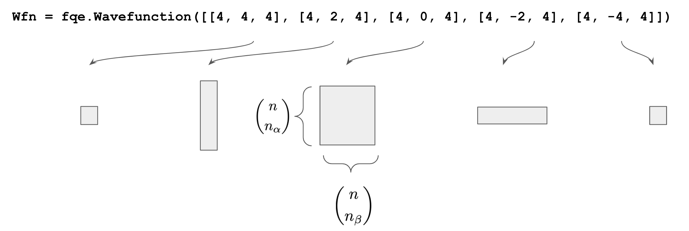

# Fermionic Quantum Emulator

The Fermionic Quantum Emulator (FQE) is a high-performance simulator specialized for Fermionic circuits. To get started,
see the [Introduction to FQE](guide/introduction.ipynb) and explore the tutorials.

